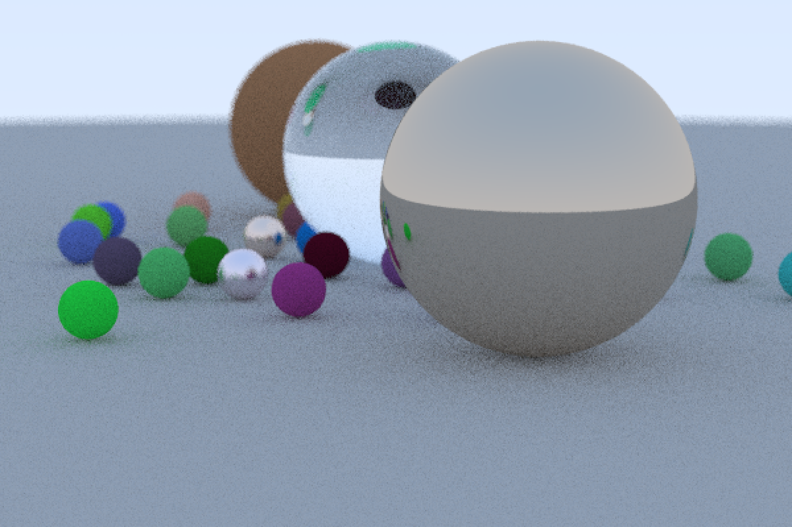

A really basic pathtracer following [Ray Tracing In One Weekend](https://raytracing.github.io/books/RayTracingInOneWeekend.html). Main differences are not using OOP, and using my preferred libraries (stb, HandmadeMath, and my personal library).

Example render, rendered in 135 seconds on my laptop:

